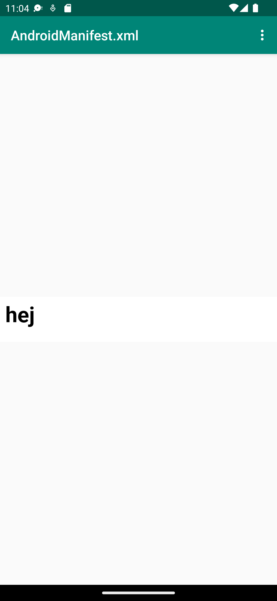
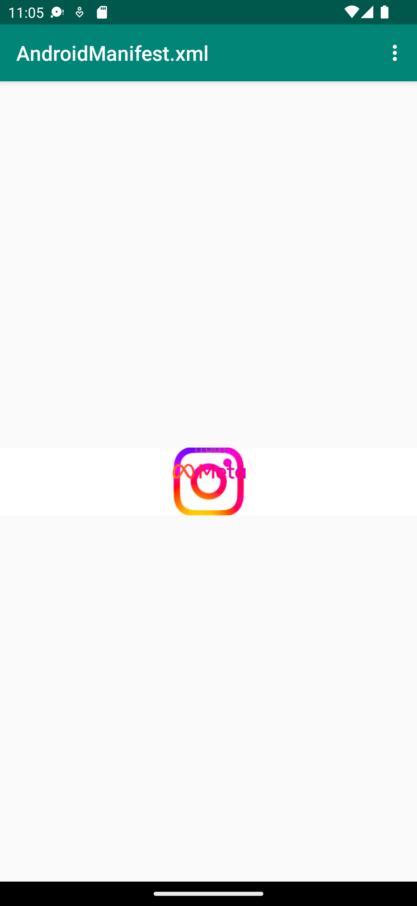

# Rapport

Jag har lagt till en webview på XML-filen "MainActivity.java" och länkat en intern och extern sida, koden nedan visar hur detta gått till. Jag har även aktiverat internet på XML-filen "AndroidManifest.xml"
```
private WebView myWebView;

    public void showExternalWebPage(){
        myWebView.loadUrl("https://www.instagram.com/");
    }

    public void showInternalWebPage(){
        myWebView.loadUrl("file:///android_asset/inl2.html");
    }

```

Bilderna nedan visar de interna och externa länkarna.




